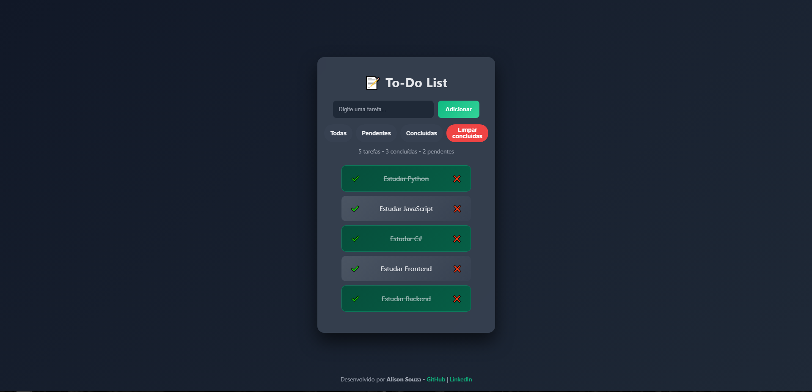

# 📝 To-Do List Premium

Uma aplicação de lista de tarefas moderna, responsiva e funcional, desenvolvida com foco em **UX (Experiência do Usuário)**. O projeto utiliza JavaScript puro para manipular o DOM, gerenciar estados de tarefas e persistir dados no navegador.

## 💻 Preview



## 🚀 Funcionalidades

- **Persistência com LocalStorage:** Suas tarefas não somem ao atualizar a página.
- **Drag & Drop Nativo:** Reorganize a ordem das suas prioridades arrastando os itens da lista.
- **Filtros Dinâmicos:** Visualize rapidamente tarefas "Todas", "Pendentes" ou "Concluídas".
- **Sistema de Contador:** Monitoramento em tempo real do total de tarefas e progresso.
- **Limpeza Inteligente:** Remova todas as tarefas concluídas com apenas um clique.
- **Interface Glassmorphism:** Design elegante com efeitos de transparência, gradientes e animações suaves.

## 🛠️ Tecnologias Utilizadas

O projeto foi construído utilizando as tecnologias fundamentais do Front-End:

- **HTML5:** Estrutura semântica e acessível.
- **CSS3:** Estilização avançada, Flexbox, efeitos de Blur (Glassmorphism) e animações de entrada.
- **JavaScript (ES6+):** Lógica de manipulação de arrays, eventos de Drag & Drop e API de Web Storage.

---

## 📂 Estrutura de Arquivos

```text
to-dolist/
├── icons/          # Ícones da aplicação (favicon)
├── index.html      # Estrutura principal
├── style.css       # Design e responsividade
├── script.js       # Lógica e comportamento
└── README.md       # Documentação do projeto
```

---

## 🔧 Como Executar o Projeto

1. **Clone este repositório:**

```git clone [https://github.com/alison-souza/to-dolist.git](https://github.com/alison-souza/to-dolist.git)

```

2. **Acesse a pasta do projeto:**

```cd to-dolist

```

3. **Abra o arquivo index.html: Você pode abrir diretamente no seu navegador ou usar a extensão Live Server no VS Code.**

---

## 🧠 Desafios e Aprendizados

Durante o desenvolvimento deste projeto, explorei conceitos avançados de Front-End:

Manipulação do DOM: Criação dinâmica de elementos HTML via JavaScript.

API de Drag and Drop: Implementação da lógica de arrastar e soltar para melhorar a interatividade.

Gerenciamento de Estado: Sincronização entre o que o usuário vê na tela e o array de objetos salvo no localStorage.

---

✨ Sinta-se à vontade para contribuir com o projeto ou dar um Fork para criar sua própria versão!
